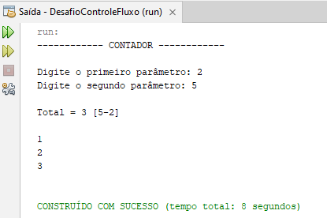

# Contador
#### Projeto Java Básico - Controle de Fluxo
 

### Sobre o Projeto

Um projeto básico em Java utilizando o Netbeans e Java 17, onde se utiliza a classe Scanner para leitura e escrita de dados e a classe System para saída no terminal. O programa solicita dois números inteiros como entrada e gera a quantidade de iterações especificada através de um laço for.

##### About the project

A basic Java project using Netbeans and Java 17, where the Scanner class is used to read and write data and the System class to output to the terminal. The program requests two integers as input and generates the specified number of iterations through a for loop.

### Ferramentas de Desenvolvimento 
##### (Development Tools)

* Netbeans
* JDK (Java 17)

### Dados do Projeto

* Nome do Projeto: DesafioControleFluxo
* Arquivo: Contador.java
* Classe: Contador
* Método Principal: Main

##### Project data

* Project Name: DesafioControleFluxo
* File: Contador.java
* Class: Contador
* Main Method: Main

### Técnicas Utilizadas

* Classe Scanner: Leitura/ Escrita
* Variáveis:
    * Do Tipo Primitivo (INT)
* Exception: Customizada
* try/catch: Tratamento de Excessões
* Estrutura de Repetição: For (Para)
* Método Estático Sem Retorno  
* Classe System: Métodos de Saída

##### (Techniques Used)

* Scanner Class: Reading/Writing
* Variables:
     * Of Primitive Type (INT)
* Exception: Custom
* try/catch: Excess Handling
* Repetition Structure: For (For)
* Static Method of No Return
* System Class: Output Methods

### Autor
##### (Project Author)
#### Katarine Albuquerque
###### Desenvolvedora Front-end
    
